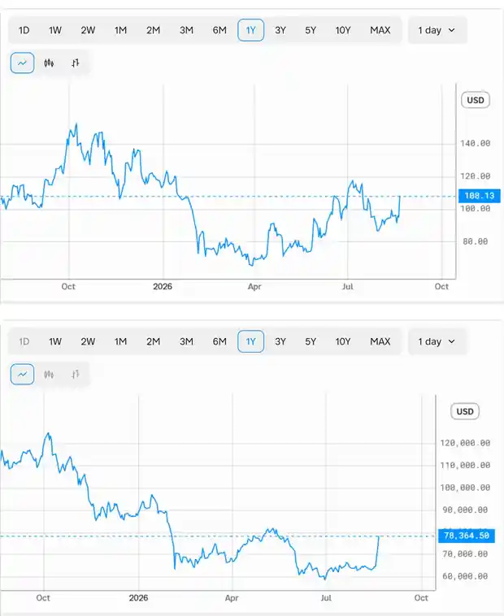

<!--
id: RX-USECASE-0050
type: use-case
language: zh
locale: zh-TW
provider: QUICK Corporation
provided: 2026-08-24
status: published
translation_status: current
source_type: partner-provided-use-case
asset_class: equities, crypto, multi-asset
publication_mode: faithful-source-preserving
-->

# 檢驗 Robinhood 與 Bitcoin 的價格關係

[← 多資產使用案例](README.md) · [依資產類別瀏覽](../README.md) · [全部使用案例](../../README.md)

**提供日期：** 2026-08-24  
**主要資產類別：** 股票、crypto、多資產

> 本案例同時移除客戶、收件人、簽名與私有連結資訊。數字與市場觀察均為原資料日期的快照。

## 問題

> 分析 @HOOD 與 Bitcoin 價格的相關性。

公司名稱容易混淆時，在 ticker 前使用 `@` 可以提高 entity resolution 的精確度。

## 研究想確認什麼

兩張價格圖可能長期都往同一方向走，但不代表每天都緊密連動。價格**水準**的高相關，也可能只是因為兩個資產共享長期趨勢而被放大。

因此，研究分四步：

1. 比較過去一年重要高點、低點與劇烈變動日期；
2. 比較價格水準相關與每日報酬相關；
3. 找出 HOOD 與 Bitcoin 分化的期間；
4. 分析什麼經濟機制可以同時解釋相關性與關係失效。

也就是把**視覺共振 → 量化相關 → 例外 → 經濟解讀**分開。

## 當時的市場快照：2025 年 8 月至 2026 年 8 月

| Episode | 時間 | HOOD | Bitcoin | 方向 |
| --- | --- | --- | --- | --- |
| 起點 | 2025 年 8 月下旬 | ~108 | ~110,000 | — |
| 高點 | 2025 年 10 月初 | ~150 | ~124,800 | 兩者都接近高點 |
| 急跌 | 2026 年 2 月初 | 72 | ~63,300 | 兩者都大跌 |
| 次低點 | 2026 年 6 月 | ~93 | ~58,500 | 部分分化 |
| 最近反彈 | 2026-08-21 | 108 | ~78,400 | 兩者都大幅反彈 |

QUICK 原研究把這段期間的關係描述為明顯正相關，估算價格水準相關約 **+0.8**，每日報酬相關約 **+0.5 至 +0.6**。

## 為什麼要分開看水準與報酬

高水準相關可能只是兩個資產長期一起上升。

每日報酬相關問的是更嚴格的問題：**兩者是否真的一天一天一起變動？**

同時使用兩者，有助於區分共同長期趨勢與較短期的同步波動。

## 分化與相關性同樣重要

原資料特別指出 2026 年 6 月：Bitcoin 繼續下跌時，HOOD 卻回升到約 105–108。

這顯示 HOOD 並不是單純的 Bitcoin proxy。公司特有因素，例如 earnings、交易活動、business mix 或 guidance，都可能在一段期間內主導 crypto 關係。

## 經濟解讀

原資料把關係連到兩個管道：

- Robinhood 對 crypto 交易活動的曝險，使 Bitcoin 市況可能影響 transaction revenue 與 engagement 預期。
- HOOD 與 Bitcoin 都可能呈現較高 beta 的 risk-asset 特徵，因此也會同時對利率與風險偏好等總體驅動因素反應。

但兩個管道都不代表永久的一比一關係。

## 如何使用結果

不要把高相關係數當作 HOOD 永遠應該被當成 Bitcoin proxy 交易的證明。

更有用的做法，是監測何時關係穩定、何時失效。後續可以追蹤：

- crypto trading volumes；
- Robinhood earnings 與 guidance；
- business mix 變化；
- 利率與更廣泛的風險偏好。

## 限制

- 原資料中的相關係數為近似值。
- 相關性會隨樣本與 horizon 改變。
- 共同總體驅動因素可以提高相關性，但不代表直接因果。

## 本使用案例說明了什麼

這個工作流程從表面上的跨資產共振出發，進一步檢驗以報酬計算的相關性，並主動尋找會破壞關係的期間。

---

本內容由 QUICK 提供。

依國家或地區、語言環境、使用產品、權限與資料涵蓋範圍不同，可能無法完全依照本文方式重現本案例。

[← 多資產使用案例](README.md) · [依資產類別瀏覽](../README.md) · [全部使用案例](../../README.md)
