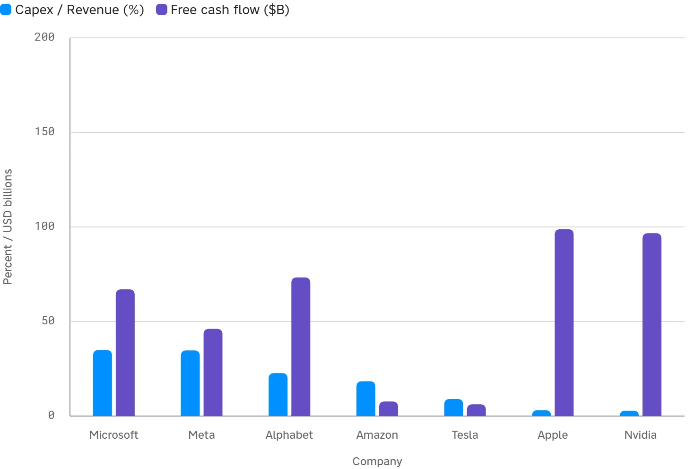

<!--
id: RX-USECASE-0064
type: use-case
language: zh
locale: zh-TW
provider: QUICK Inc.
provided: 2026-09-17
status: published
translation_status: current
original_language: en
source_text_status: localized_from_en_canonical
source_type: partner-provided-use-case
asset_class: Equities, Fixed Income
publication_mode: faithful-source-preserving
-->

# 比較 Magnificent Seven 的財務實力與利率韌性

[← 股票使用案例](README.md) · [依資產類別瀏覽](../README.md) · [全部使用案例](../../README.md)

**提供日期：** 2026-09-17  
**主要資產：** 股票、固定收益

> 本案例中的數據與市場環境反映提供日期當時的情況。

> ### [在 Reflexivity 中開啟這個研究範例 →](https://app.reflexivity.com/app/alfred?mode=research&conversationId=21bf31be-608b-4468-9697-9408b296d4dc&scrollTo=top)

## 問題

**比較 Magnificent Seven 的財務狀況，特別聚焦融資與投資，並評估它們對利率變化的承受能力。**

## 財務實力的差異在哪裡

依最近一個會計年度的財務報表，從**流動性、負債、淨現金、資本支出、自由現金流、融資與利率韌性**等面向比較 Magnificent Seven。

即使在原始資料所描述的高利率環境中，多數公司仍產生非常可觀的營運現金流。主要差異在於：有些公司可以主要依靠內部現金支持持續擴大的 AI 與資料中心投資，另一些公司則透過增加債券發行補充內部現金創造。

### 財務比較

| 公司 | 流動性 ($B) | 總負債 ($B) | 淨現金 ($B) | 負債/權益 | 利息保障倍數 | Capex/營收 | FCF ($B) | 債券發行 ($B) |
| --- | ---: | ---: | ---: | ---: | ---: | ---: | ---: | ---: |
| Alphabet | 126.8 | 52.2 | 74.7 | 0.13 | 36x | 22.7% | 73.3 | 64.6 |
| Nvidia | 62.6 | 8.8 | 53.7 | 0.06 | 64x | 2.8% | 96.7 | 0.0 |
| Tesla | 44.1 | 9.2 | 34.9 | 0.11 | 3x | 9.0% | 6.2 | 5.6 |
| Amazon | 123.0 | 91.2 | 31.8 | 0.22 | 38x | 18.4% | 7.7 | 25.0 |
| Microsoft | 76.8 | 50.0 | 26.9 | 0.11 | 706x | 34.9% | 67.0 | 0.0 |
| Meta | 81.6 | 61.3 | 20.3 | 0.28 | 87x | 34.7% | 46.1 | 29.9 |
| Apple | 54.7 | 100.8 | -46.1 | 1.37 | 淨利* | 3.1% | 98.8 | 4.5 |

## 四個重要差異

1. **淨現金狀況明顯分化。**  
   表中只有 Apple 處於淨負債狀態，其餘六家公司都是淨現金。Alphabet 的淨現金最高，約 747 億美元。

2. **投資強度差異很大。**  
   Microsoft 與 Meta 的資本支出約占營收 35%。Amazon 的投資也很大，使自由現金流壓縮到 77 億美元。以這項指標來看，Nvidia 與 Apple 更偏輕資產。

3. **融資策略正在分化。**  
   Alphabet、Amazon 與 Meta 使用大規模新增債券融資補充 AI 投資，而原始資料比較中的 Nvidia 與 Microsoft 幾乎沒有或沒有新增負債發行。

4. **利率韌性並不相同。**  
   Microsoft 的利息保障倍數為 706x，Meta 為 87x。Tesla 約為 3x，依這項指標是七家公司中對利率最敏感的。

## 利率韌性分組

- **韌性最高：Microsoft 與 Nvidia。**  
  低槓桿、大量淨現金與較高的利息保障倍數，使高利率的直接負擔有限。
- **投資擴大、同時借款增加的中間組：Alphabet、Amazon 與 Meta。**  
  隨著投資擴大，債券發行增加，但營運現金流仍然很大，原始資料中的利息保障倍數也保持健康。
- **相對較脆弱：Apple 與 Tesla。**  
  Apple 是表中唯一淨負債的公司，而 Tesla 的獲利能力與利息保障倍數低於其他公司。

因此，這種比較比單純按現金餘額排序更有用。它把**AI 投資強度、債券發行、再融資成本與償債能力**放在同一個視圖中。

## 限制

- 各公司的會計年度結束日不同，因此並非完全同步的時點比較。
- Apple 的淨利息費用在財務報表中幾乎相互抵銷，所以原始資料沒有為 Apple 計算一般的利息保障倍數。
- 總負債定義可能不同，包括租賃負債的處理方式。
- 利率敏感度評估沒有完整建模固定利率與浮動利率負債。

後續可進一步比較各公司的負債到期結構、固定／浮動利率曝險，以及最新季度投資指引。

---

本內容由 QUICK 提供。

依國家或地區、語言環境、使用產品、權限與資料涵蓋範圍不同，可能無法完全依照本文方式重現本案例。

[← 股票使用案例](README.md) · [依資產類別瀏覽](../README.md) · [全部使用案例](../../README.md)
